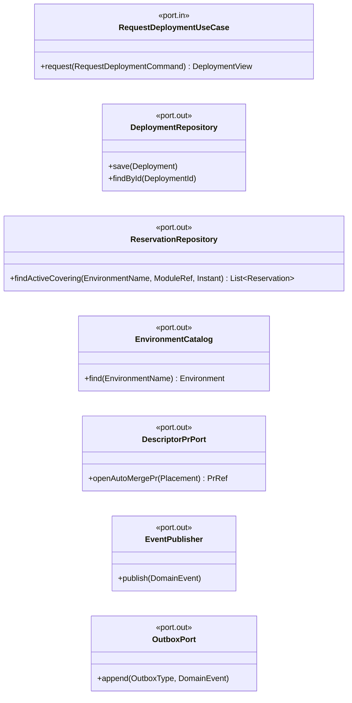

# application.port

```mermaid
classDiagram
  direction LR
  class RequestDeploymentUseCase {
    <<port.in>>
    +request(RequestDeploymentCommand) DeploymentView
  }
  class DeploymentRepository {
    <<port.out>>
    +save(Deployment)
    +findById(DeploymentId)
  }
  class ReservationRepository {
    <<port.out>>
    +findActiveCovering(EnvironmentName, ModuleRef, Instant) List~Reservation~
  }
  class EnvironmentCatalog {
    <<port.out>>
    +find(EnvironmentName) Environment
  }
  class DescriptorPrPort {
    <<port.out>>
    +openAutoMergePr(Placement) PrRef
  }
  class EventPublisher {
    <<port.out>>
    +publish(DomainEvent)
  }
  class OutboxPort {
    <<port.out>>
    +append(OutboxType, DomainEvent)
  }
```

Ports are the contracts the use-case test runs against with stubs; no test of their own.
