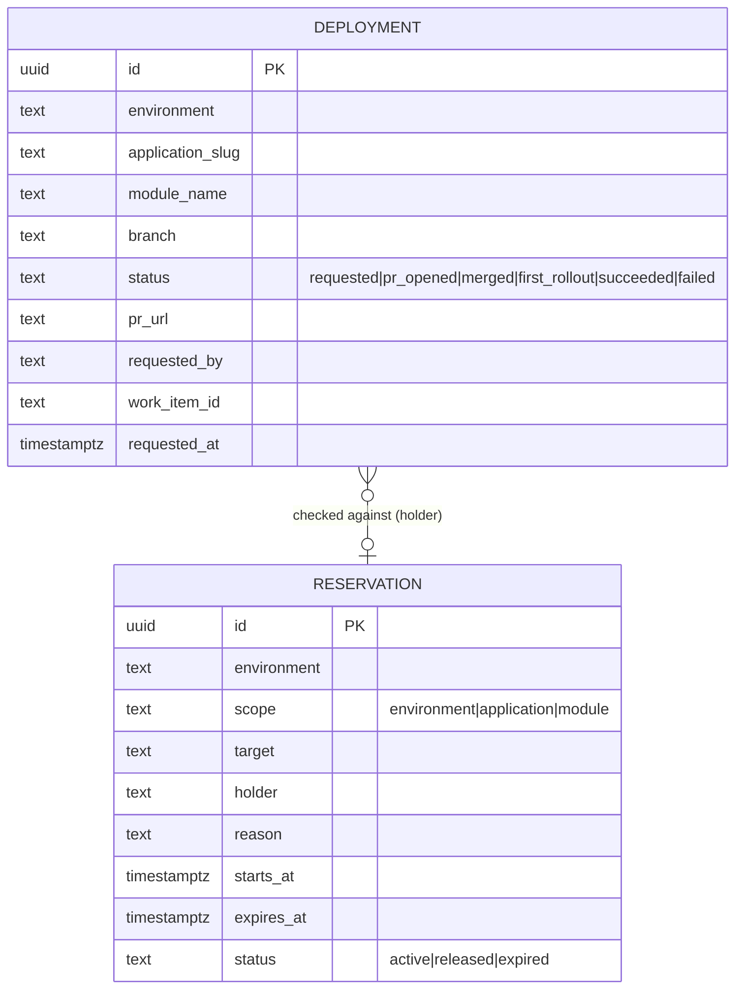

Persistent shape of a Deployment and of the Reservations it was checked against.

```mermaid
erDiagram
  DEPLOYMENT {
    uuid id PK
    text environment
    text application_slug
    text module_name
    text branch
    text status "requested|pr_opened|merged|first_rollout|succeeded|failed"
    text pr_url
    text requested_by
    text work_item_id
    timestamptz requested_at
  }
  RESERVATION {
    uuid id PK
    text environment
    text scope "environment|application|module"
    text target
    text holder
    text reason
    timestamptz starts_at
    timestamptz expires_at
    text status "active|released|expired"
  }
  DEPLOYMENT }o--o| RESERVATION : "checked against (holder)"
```

Status transitions follow `Deployment.status` in the domain reference §9.
