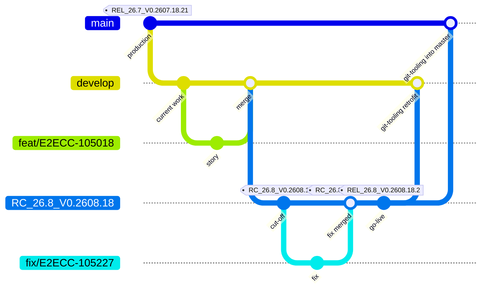

# Our Git model and release cycle

Aligned with the Confluence pages *Monthly + Minor Releases*, *Hotfix* and *Git-Tooling*. Items in `[brackets]` are still to be confirmed.

## Branches and environments

| Branch | Role | Environments (VM / K8S) |
|---|---|---|
| `feature/*` | One per US or bug, created from the branch it will be merged into | — / TEAM DEV |
| `develop` | Release N+2: all developments until the cut-off | QA / INT |
| `RC_X+1` | Next monthly release: created from develop at the cut-off, stabilised for a month | UAT (NRT), STAGING (performance) / mycreditapp-release |
| `RC_X` | The last release candidate delivered in production; hosts the minor releases | QA-FIX / mycreditapp-minor-release (TRAINING) |
| `master` | Production (there is no separate production branch); tagged at each go-live; hotfixes are delivered as a new tag from master | QA-FIX / mycreditapp-prod |

RC naming: `RC_YY.n_V0.YYMM.m` (YY year, n incremented on each monthly release, V0.YYMM.m the develop tag the branch is created from). After its go-live, RC_X+1 becomes the RC_X that hosts the minor releases.

### Naming used in the examples

| What | Name |
|---|---|
| Current production tag (on `master`) | `REL_26.7_V0.2607.18.21` |
| RC_X, minor-release branch | `RC_26.7_V0.2607.18` |
| RC_X+1, next major release branch | `RC_26.8_V0.2608.18` |
| Package tags on RC_26.8 (next major) (one per bug-fix merge / build) | `branch.increment`, incremented by 1 with no gap: `RC_26.8_V0.2608.18.1` (cut-off), then `RC_26.8_V0.2608.18.2` (bug fix merged); the package freeze creates no tag, it freezes the last tagged package |
| Next production tag | `REL_26.8_V0.2608.18.2` (same increment as the delivered package) |
| Minor release package tag (on RC_26.7, at the merge) / production tag (on the RC at go-live) | `RC_26.7_V0.2607.18.22` / `REL_26.7_V0.2607.18.22` [to be confirmed] |
| Hotfix production tag | `REL_26.7_V0.2607.18.21.1` [to be confirmed] |
| Feature branches | `feat/E2ECC-105018` (story), `epic/E2ECC-105100` with `feat/E2ECC-105141` (Story A) and `feat/E2ECC-105142` (Story B), `fix/E2ECC-105227` (release bug), `fix/E2ECC-105310` (minor), `fix/E2ECC-105402` (hotfix) |

**Git-tooling** (Jenkins, nightly) retrofits fixes so they are never forgotten, with automerge when there is no conflict:
- master into RC_X (hotfixes)
- RC_X into RC_X+1 (minor-release fixes and hotfixes)
- RC_X+1 into develop (release fixes, minor-release fixes and hotfixes)
- the delivered RC into master, once the package is in production (no tag: the production tag `REL_…` is put on the RC branch at go-live)

On conflict it opens a PR from an intermediate branch `merge_RC_X_in_Y`. Always merge with the **merge commit** strategy, never rebase and merge.

### Team environment descriptor

Each team environment (K8S namespace) has one YAML file in the [e2ecc-k8s-envs](https://bitbucket.cib.echonet/projects/E2ECC/repos/e2ecc-k8s-envs/) repository, where descriptor changes are made. It lists only the modules under test, with the branch whose image they run; every module not listed is served by the **upstream** environment.

```yaml
# e2ecc-k8s-envs/mycreditapp/team-env-7.yml
global:
  upstream: https://mycreditapp-develop.dev.echonet   # develop; modules not listed come from here
  modules:
    request:
      enabled: true
      image:
        branch: epic/E2ECC-105100                      # Story A, already merged into the epic
    facility:
      enabled: true
      image:
        branch: feat/E2ECC-105142                      # Story B, under test
```

Resolved pods for this example: `request` → epic branch, `facility` → Story B branch, `client` and other modules → upstream (develop).

| Step | request | facility | client, other modules |
|---|---|---|---|
| Standard story, Testing | `feat/E2ECC-105018` | upstream | upstream |
| Large project, Story A Testing | `feat/E2ECC-105141` | upstream | upstream |
| Large project, Story A Integration Testing | `epic/E2ECC-105100` | upstream | upstream |
| Large project, Story B Testing | `epic/E2ECC-105100` | `feat/E2ECC-105142` | upstream |
| Large project, Story B Integration Testing | `epic/E2ECC-105100` | `epic/E2ECC-105100` | upstream |

Integration testing of a large project is done **on the epic branch only**: no feature branch in the descriptor.

Upstream by path: `develop` for features and epics; [release env for release bug fixing, minor-release (TRAINING) for minor fixes, and the hotfix upstream: to be confirmed].

## Feature cycle: a cycle, repeated for every change

| Path | Cycle |
|---|---|
| Small feature | Ready for Development → In Progress → Code Review → Testing → Merge → Integration Testing (`develop`) |
| Large project | Ready for Development → In Progress → Code Review → Testing → Merge → Integration Testing (epic branch only) → Merge → Integration Testing (`develop`) |
| Minor, standard story | Ready for Development → In Progress → Code Review → Testing → Merge → Integration Testing (`RC_X`) |
| Minor, large project | Ready for Development → In Progress → Code Review → Testing → Merge → Integration Testing (epic branch only) → Merge into `RC_X` → Integration Testing (`RC_X`) |
| Incident (hotfix) | Ready for Development → In Progress → Code Review → Testing → Merge → Integration Testing (`master`) |

- **Code Review**: pull request review and CI; no commit reaches the target branch at this stage.
- **Testing**: functional tests on the Dev Team environment, including UI/UX testing.
- **Integration Testing**: functional tests on the target branch environment (INT (K8S) for develop, TRAINING for RC_X).
- **Merge deadline**: one day before the cut-off. Jiras not merged at the cut-off meeting move to the next release, with no exception. All Jiras with the monthly Fix Version must be closed before the cut-off.

## Release process: a calendar

Week n schedule (monthly releases; minor releases have no pre-CRB or CRB). Every path has pre-release sanity checks in PRE-PROD and sanity checks in PROD after the go-live:

| When | What |
|---|---|
| Week n-1 | Request for change created |
| Friday, before the pre-CRB and CRB | Package freeze: last auto-generated package frozen (no new tag), Jenkins NRT job frozen; GB flow prepared for new flows (CFT, API…) [scope to be defined] |
| Tuesday PM | Pre-CRB: evidence (performance, NRT, rehearsal…) presented to the production teams; if not validated, the release is delayed |
| Before the CRB | Pre-release sanity checks in PRE-PROD, to validate the package |
| Tuesday | Last sanity tests, package sent to APS, rehearsal in PRE-PROD |
| After the go-live | Sanity checks in PROD: state of the application in production (new flows, infrastructure…) and critical E2E scenarios, which drive the decision |
| Wednesday AM | CRB with top management |
| Thursday noon | Go-live (best case) |

### Monthly (major) release

| Stabilisation (month M, daily) | Release Preparation (cut-off, month M+1) | Release (week n) | Sign-off (week n) |
|---|---|---|---|
| Promotion (INT) *auto*: end-of-day pre-package deployed on INT | **Cut-off** ◆ RC_X+1 created from develop, on the commit of the last package deployed on QA | **Pre-CRB** ■ | **CRB** ■ |
| Promotion (QA) *auto*: same pre-package on QA, when the INT pipeline is successful | Promotion (NRT, Performance) *auto*: UAT for NRT, STAGING for performance | **Package freeze** ◆ | **Go-live** |
| | Testing (NRT, Performance): both mandatory | Promotion (Rehearsal) *manual*: PRE-PROD | Business Go / NoGo *optional, after the go-live*: validates the opening of a feature hidden behind a toggle (high-risk releases only) |
| | Bug fixing (regressions, critical bugs): fix branch `fix/E2ECC-…` from RC → Dev Team env → merge into RC → release env | Sanity checks: PRE-PROD, APS | |

After the cut-off, only defects and bugs (except Minor) may be merged, into RC_X+1. Anything else needs a justification emailed to Release Management.

### Minor release

Only for topics that cannot wait for the next monthly release. The Jira must be listed on *Hotfix/Minor: Content & Follow-up* before its PR can be merged into RC_X. No performance tests (topics with no performance impact only) and no full NRT: the Development Team runs the NRT on the impacted scope.

| Stabilisation | Release Preparation | Release (week n) | Sign-off (week n) |
|---|---|---|---|
| Promotion (minor-release) *auto*: TRAINING | All Jiras closed ◆ *[minor equivalent of the cut-off?]* | **Package freeze** ◆ | **Go-live** |
| | Promotion (QA-FIX) *manual*, by DevOps | | |
| | Testing (NRT on impacted scope), Development Team | Promotion (Rehearsal) *manual* | |
| | Sanity checks (QA-FIX), Development Team | Sanity checks (PRE-PROD), APS | |

Extra rule: if a ticket delivered through a minor release causes a regression in production, the team cannot deliver any ticket in the next two minor releases.

### Hotfix

Only for bugs raised in production that cannot wait for the next monthly or minor release. No performance tests; the Development Team alone is responsible for testing.

Prerequisites: Jira version (e.g. *26.1 Hotfix 3*), bug with priority Critical or Blocker, ServiceNow incident number, remediation plan; email to Release Management and APS; once approved, a run-book from the template. The originator coordinates everyone in the Hotfix Team Channel.

| Release Preparation (on demand) | Release (on demand) |
|---|---|
| Promotion (QA-FIX) *manual* | Promotion (Rehearsal) *manual* |
| Testing (NRT), Development Team | Sanity checks |
| | **Go-live**: new tag from master |

No release branch is created: the fix goes from a feature branch into master, then Git-tooling retrofits it into RC_X, RC_X+1 (if open) and develop.

## Walkthrough: the Git flow for a monthly release



*Here `main` stands for `master`. The graph starts from the version in production (tagged on master) and the current state of develop. After the go-live, RC_26.8_V0.2608.18 becomes the RC_X that hosts the minor releases.*

### Timeline item types

- **Event**: a step of the dev lifecycle, mostly a Jira status (Ready for Development, In Progress, Code Review, Testing, Merge, Integration Testing), plus testing activities (NRT, sanity checks).
- **Gate**: a freeze or a decision (cut-off, package freeze). The package freeze comes before the CRB and produces the package tag.
- **Milestone**: meetings (pre-CRB, CRB), the go-live. The optional business Go / NoGo comes after the go-live: it validates opening a feature behind a toggle, and is not shown in the timeline.
- **CI/CD**: automation from the DevOps tooling: promotions (automatic or manual deploys) and Git-tooling retrofit merges.

Tags on `master` are production tags (`REL_…`); tags on RC branches are package tags (`RC_….increment`).

## Git-tooling: how fixes travel between branches

Developers merge by pull request into one branch only. A single Jenkins job, Git-tooling, then carries the change to the other long-lived branches, from master up to develop.

### 1 · The job

Git-tooling is one job that runs at fixed times. Each run merges one source branch into one target branch (automerge, merge commit strategy).

- `RC_YY.X`: production branch (minor-release), the release currently in production. Minor fixes are merged here.
- `RC_YY.X+1`: release branch, the next monthly release, created from develop at cut-off. Stabilisation fixes are merged here.
- Full name: `RC_YY.n_V0.YYMM.m`, where `m` is incremented on each QA delivery from develop.

| Run (CET) | Source → target | What it carries |
|---|---|---|
| 19:00 | `master` → `RC_YY.X` | Retrofits the hotfixes |
| 20:00 | `RC_YY.X` → `RC_YY.X+1` | Minor fixes and hotfixes |
| 21:00 | `RC_YY.X+1` → `develop` | All fixes |
| 05:00 | Delivered RC (`RC_YY.X` or `RC_YY.X+1`) → `master` | The released code, only once the production package is delivered |

A run with nothing new to merge ends with "Already up to date" and creates no commit.

### 2 · Live example (`RC_YY.X` = `RC_26.7_V0.2607.18`, `RC_YY.X+1` = `RC_26.8_V0.2608.18`)

- **Hotfix**: PR `fix/E2ECC-105402` → master; go-live from master (`REL_26.7_V0.2607.18.21.1`); 19:00 master → RC_26.7; 20:00 RC_26.7 → RC_26.8; 21:00 RC_26.8 → develop.
- **Minor**: PR `fix/E2ECC-105310` → RC_26.7; 19:00 no commit; 20:00 RC_26.7 → RC_26.8; 21:00 RC_26.8 → develop; go-live (`REL_26.7_V0.2607.18.22`); 05:00 RC_26.7 → master.
- **Monthly**: PR `fix/E2ECC-105227` → RC_26.8; 19:00 and 20:00 no commit; 21:00 RC_26.8 → develop; go-live (`REL_26.8_V0.2608.18.2`); 05:00 RC_26.8 → master; RC_26.8 becomes the production branch.

### 3 · Good to know

- **Merge commits, no tags**: every automerge is a merge commit. Git-tooling never creates tags: package tags come from cut-off and RC merges, REL tags from go-live.
- **A conflict opens a pull request**: the run stops and opens a PR from a `merge_…_in_…` branch. The team resolves it; the cascade resumes the next night.
- **Release becomes production**: after go-live, `RC_YY.X+1` becomes the new `RC_YY.X`. The next `RC_YY.X+1` is created from develop at the next cut-off.
